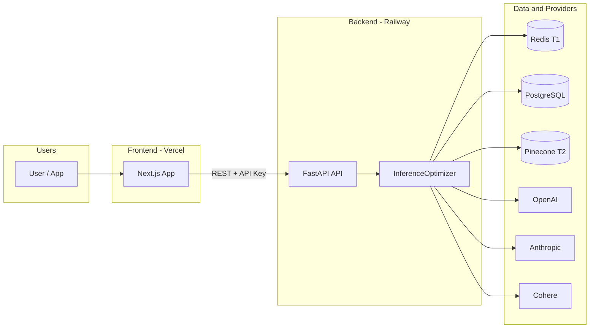
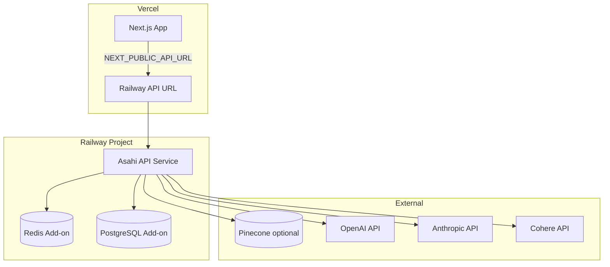
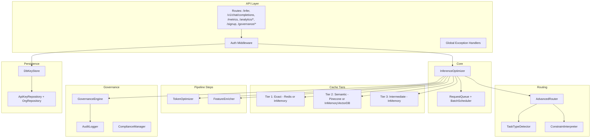

# Asahi Implementation Handoff Document

> **Purpose:** Complete context for continuing development and deployment.  
> **Last Updated:** 2026-02  
> **Status:** Steps 1–7 ✅ | Phase 0, 3.1, 3.2, 1.2, 2.4, 3.3 ✅ | Full frontend ✅ | Railway + Vercel deploy ready  
> **Production path:** Option A (Python-first) per `docs/PRODUCTION_ROADMAP_DETAILED.md`

---

## Table of Contents

1. [Executive Summary](#1-executive-summary)
2. [Architecture Diagrams](#2-architecture-diagrams)
3. [What Was Implemented](#3-what-was-implemented)
4. [Backend Architecture](#4-backend-architecture)
5. [Frontend Architecture](#5-frontend-architecture)
6. [API Reference](#6-api-reference)
7. [Configuration and Environment](#7-configuration-and-environment)
8. [Deployment (Railway + Vercel)](#8-deployment-railway--vercel)
9. [Important Code Locations](#9-important-code-locations)
10. [File Structure](#10-file-structure)
11. [Testing](#11-testing)
12. [Known Limitations and Troubleshooting](#12-known-limitations-and-troubleshooting)
13. [Next Steps](#13-next-steps)
14. [Summary Checklist](#14-summary-checklist)

---

## 1. Executive Summary

### Current State

- **Backend (FastAPI):** Three-tier cache (exact, semantic, intermediate), AdvancedRouter (autopilot/guided/explicit), TokenOptimizer, FeatureEnricher, batching (queue + scheduler), API key auth, RBAC, audit logging, governance (policies, budget, usage API), self-serve signup, optional welcome email. Persistence: PostgreSQL (orgs, API keys), Redis (Tier 1), optional Pinecone (Tier 2). Async hot path (`asyncio.to_thread`), connection pooling (reused OpenAI/Anthropic clients).
- **Frontend (Next.js):** Landing page, signup, dashboard (metrics, charts, recent inferences), inference testing, cache management, analytics, settings (API URL + API key). Design system: Asahi orange (#FF6B35), Inter, wireframe-aligned. Deployable on Vercel.
- **Deployment:** Backend on Railway (Procfile/Dockerfile); Frontend on Vercel (root `frontend/`). Docs: `docs/RAILWAY_DEPLOYMENT.md`, `docs/DEPLOYMENT_VERCEL_RAILWAY.md`.
- **Docs:** API contract, Quick start, Integration guide, ROI/pricing, Prometheus scrape, Load test, OpenAPI at `/openapi.json`.

### Key Metrics

- Test coverage 95%+ on core components.
- Cache: Tier 1 (exact), Tier 2 (semantic, 85%+ similarity), Tier 3 (intermediate workflow).
- Target: &lt;5 ms overhead, 500+ req/s (load test: `docs/LOAD_TEST.md`).

---

## 2. Architecture Diagrams

### 2.1 System Overview



### 2.2 Inference Request Flow

```mermaid
sequenceDiagram
  participant Client
  participant API as FastAPI
  participant Opt as InferenceOptimizer
  participant T1 as Tier 1 Cache
  participant T2 as Tier 2 Semantic
  participant T3 as Tier 3 Intermediate
  participant Gov as GovernanceEngine
  participant Router as AdvancedRouter
  participant LLM as OpenAI/Anthropic

  Client->>API: POST /infer (prompt, routing_mode, ...)
  API->>API: Auth (API key), RBAC scope
  API->>Opt: infer() [via asyncio.to_thread]
  Opt->>Gov: enforce_policy(org_id, model, cost) [if org set]
  alt policy denied
    Gov-->>Opt: BudgetExceeded / PermissionDenied
    Opt-->>API: 429 / 403
  end
  Opt->>T1: get(prompt)
  alt T1 hit
    T1-->>Opt: cached result
    Opt-->>API: InferenceResult (cache_tier=1)
  else T1 miss
    Opt->>T2: get(prompt, task_type, ...)
    alt T2 hit
      T2-->>Opt: semantic result
      Opt-->>API: InferenceResult (cache_tier=2)
    else T2 miss
      Opt->>T3: decompose + get steps [if workflow]
      alt T3 hit
        T3-->>Opt: intermediate result
        Opt-->>API: InferenceResult (cache_tier=3)
      else T3 miss
        Opt->>Router: route(prompt, mode, ...)
        Router-->>Opt: RoutingDecision
        Opt->>LLM: chat.completions / messages.create
        LLM-->>Opt: response, tokens
        Opt->>Opt: record_spend(org_id, cost)
        Opt->>T1: set(); Opt->>T2: set(); Opt->>T3: set()
        Opt-->>API: InferenceResult (cache_tier=0)
      end
    end
  end
  API-->>Client: InferResponse (JSON)
```

### 2.3 Deployment Architecture



### 2.4 Backend Component Stack



---

## 3. What Was Implemented

### 3.1 Backend (Steps 1–7 and Phases)

| Area | Implementation |
|------|----------------|
| **Step 1** | Global exception handler for all `AsahiException` types and generic `Exception`; consistent JSON error body with `request_id`. |
| **Step 2** | Tier 2 semantic cache + Tier 3 intermediate cache; AdvancedRouter (AUTOPILOT, GUIDED, EXPLICIT); dual-threshold semantic match. |
| **Step 3** | TokenOptimizer wired in optimizer (before routing); quality risk respected. |
| **Step 4** | FeatureEnricher wired when `user_id`/`organization_id` present; timeout fallback. |
| **Step 5** | Full batching: RequestQueue, BatchScheduler, executor runs `optimizer.infer` per request; batch-eligible requests enqueued, timeout fallback. |
| **Step 6** | Auth middleware (API key); RBAC scopes (infer, analytics, admin, all); governance policy and budget checks in optimizer; audit logging (auth_failure, inference, api_key_created, policy_update). |
| **Step 7** | PostgreSQL (orgs, api_keys) via ApiKeyRepository, OrgRepository, DbKeyStore; Redis Tier 1 when `REDIS_URL`; Pinecone Tier 2 when `PINECONE_API_KEY`. |
| **Phase 0** | API contract doc, OpenAPI link, roadmap alignment (INTEGRATION_ROADMAP, HANDOFF). |
| **Phase 3.1** | `GovernanceEngine.get_usage(org_id, period_hours)`; `GET /governance/usage?org_id=&period=day\|month` (admin); returns request_count, total_cost_usd, policy_limits. |
| **Phase 3.2** | `POST /signup` (org_name, user_id, email); creates org + API key (DB); optional welcome email (SendGrid). OrgRepository, `src/governance/email.py`. |
| **Phase 1.2** | Infer run in thread pool (`asyncio.to_thread`); shared OpenAI/Anthropic clients (connection pooling); load test doc + Locust. |
| **Phase 2.4** | Prometheus scrape doc; structured logging (request_id, org_id, model_used, cost, cache_hit). |
| **Phase 3.3** | Quick start, Integration guide, ROI/pricing docs; README links. |

### 3.2 Frontend

| Page | Description |
|------|-------------|
| **/** | Landing: hero, “Why ASAHI” (3 tiers, Tier 2 highlighted), production metrics (87%, 150ms, 98%, 4.8/5), orange CTA, dark footer. |
| **/signup** | Self-serve signup; stores API key in localStorage; redirects to dashboard. |
| **/api-docs** | Link to backend `/docs` (Swagger) using API URL from Settings or env. |
| **/dashboard** | Metric cards (savings %, requests, total cost, quality); cache hit line; cost-by-tier pie; recent inferences table. |
| **/inference** | Routing mode, prompt textarea, advanced options; Run Inference; response card (model, cost, cache hit, latency). |
| **/cache** | Cache stats (T1/T2/T3 hits, hit rate), bar chart, recent activity table. |
| **/analytics** | Time range; cost-by-model bar; cost trend line; top insights. |
| **/settings** | API base URL (localStorage); API key (show/set). |

**Design:** Wireframe-aligned; Asahi orange (#FF6B35), Inter, 8px grid; Button, Card, Sidebar, Navbar, Input, Toggle, MetricCard, FeatureCard, DashboardLayout.

**API client:** `lib/api.ts` — base URL from localStorage or `NEXT_PUBLIC_API_URL`; API key from localStorage or `NEXT_PUBLIC_API_KEY`; `getMetrics`, `getCostSummary`, `getRecentInferences`, `getCachePerformance`, `getCostBreakdown`, `getTrends`, `infer`, `signup`.

### 3.3 Deployment

- **Railway:** Backend from repo root (Procfile / Dockerfile); Redis + Postgres add-ons; env vars as in RAILWAY_DEPLOYMENT.md.
- **Vercel:** Frontend with root directory `frontend`; `NEXT_PUBLIC_API_URL` = Railway API URL.
- **Docs:** `docs/RAILWAY_DEPLOYMENT.md`, `docs/DEPLOYMENT_VERCEL_RAILWAY.md`.

---

## 4. Backend Architecture

### 4.1 Inference Pipeline (Order)

1. **Auth:** API key validated; scopes checked per route.
2. **Governance:** If `organization_id` set, `enforce_policy(org_id, model, estimated_cost)`; on violation raise BudgetExceededError / PermissionDeniedError.
3. **Batching (optional):** If batch-eligible, enqueue and wait on `future.result(timeout)`; on timeout run normal path.
4. **Tier 1:** Exact match cache (Redis or in-memory).
5. **Tier 2:** Semantic cache (embedding + vector search + threshold); Pinecone or InMemoryVectorDB.
6. **Tier 3:** Workflow decompose + intermediate cache lookup.
7. **Token optimization (optional):** TokenOptimizer reduces prompt.
8. **Feature enrichment (optional):** FeatureEnricher when user_id/org_id present.
9. **Routing:** AdvancedRouter (autopilot/guided/explicit) or basic Router.
10. **Execute:** OpenAI or Anthropic (reused client per process).
11. **Record:** `record_spend(org_id, cost)`; store in all cache tiers; tracker event; audit log inference.

### 4.2 Auth and RBAC

- **Auth:** `Authorization: Bearer <key>`. When `ASAHI_AUTH_API_KEY_REQUIRED=true`, unauthenticated requests to protected paths get 401. `/health`, `/docs`, `/openapi.json`, `/redoc` are unauthenticated.
- **Scopes:** infer, analytics, admin, all (or `*`). `/infer` requires infer/all; analytics routes require analytics/admin/all; `/governance/*` requires admin/all. Empty scopes or `*` allow.
- **Storage:** When `DATABASE_URL` is set, keys (and orgs) are in PostgreSQL via ApiKeyRepository, DbKeyStore.

### 4.3 Exception Mapping

| Exception | HTTP |
|-----------|------|
| NoModelsAvailableError, ProviderError | 503 |
| ModelNotFoundError, ConfigurationError, FeatureConfigError | 400 |
| EmbeddingError, VectorDBError, FeatureStoreError, ObservabilityError, BatchingError | 502 |
| BudgetExceededError | 429 |
| PermissionDeniedError, ComplianceViolationError | 403 |
| Generic Exception | 500 |

---

## 5. Frontend Architecture

### 5.1 Stack

- Next.js 14 (App Router), TypeScript, Tailwind CSS, Recharts.
- Design tokens in `tailwind.config.ts` (asahi orange, neutrals, semantic colors).

### 5.2 Key Components

- **Layout:** `Navbar`, `Sidebar`, `DashboardLayout` (sidebar + main content header).
- **UI:** `Button` (primary/secondary/outline/ghost), `Card`, `FeatureCard`, `MetricCard`, `Input`, `TextArea`, `Toggle`.

### 5.3 Data Flow

- API base URL: `localStorage.asahi_api_url` or `NEXT_PUBLIC_API_URL`.
- API key: `localStorage.asahi_api_key` or `NEXT_PUBLIC_API_KEY`; sent as `Authorization: Bearer` for all backend calls except `/signup`.
- Dashboard/Analytics/Cache pages call `/metrics`, `/analytics/cost-summary`, `/analytics/recent-inferences`, `/analytics/cache-performance`, `/analytics/cost-breakdown`, `/analytics/trends`.

---

## 6. API Reference

### 6.1 Public / Unauthenticated

| Method | Path | Description |
|--------|------|-------------|
| GET | /health | status, version, uptime, components |
| GET | /docs | Swagger UI |
| GET | /openapi.json | OpenAPI 3 schema |
| GET | /redoc | ReDoc |
| POST | /signup | Self-serve signup (org_name, user_id, email) |

### 6.2 Inference (scope: infer or all)

| Method | Path | Description |
|--------|------|-------------|
| POST | /infer | Native inference (prompt, routing_mode, etc.) |
| POST | /v1/chat/completions | OpenAI-compatible chat |

### 6.3 Metrics and Models (scope: infer or analytics/admin/all)

| Method | Path | Description |
|--------|------|-------------|
| GET | /metrics | Aggregated metrics (total_cost, cache_hit_rate, tier1/2/3_hits, etc.) |
| GET | /models | Registered models with pricing |

### 6.4 Analytics (scope: analytics or admin or all)

| Method | Path | Description |
|--------|------|-------------|
| GET | /analytics/cost-summary | total_cost, total_requests, cache_hit_rate, cache_cost_saved, uptime_seconds |
| GET | /analytics/recent-inferences | Last N events (request_id, model_used, cost, cache_hit, timestamp, ...) |
| GET | /analytics/cost-breakdown | By model/task/period |
| GET | /analytics/trends | Time-series (metric, period, intervals) |
| GET | /analytics/forecast | Cost forecast, budget risk |
| GET | /analytics/anomalies | Anomaly detection |
| GET | /analytics/recommendations | Optimization recommendations |
| GET | /analytics/cache-performance | Per-tier performance |
| GET | /analytics/latency-percentiles | p50, p75, p90, p95, p99 |
| GET | /analytics/prometheus | Prometheus text exposition |

### 6.5 Governance (scope: admin or all)

| Method | Path | Description |
|--------|------|-------------|
| POST | /governance/api-keys | Create API key (X-Admin-Secret or admin scope) |
| GET | /governance/policies/{org_id} | Get policy |
| POST | /governance/policies/{org_id} | Set policy |
| GET | /governance/usage | Request count and cost (org_id, period=day\|month) |
| GET | /governance/audit | Query audit log |
| GET | /governance/compliance/report | Compliance report |

---

## 7. Configuration and Environment

### 7.1 Backend (API)

| Variable | Required | Description |
|----------|----------|-------------|
| OPENAI_API_KEY | Yes (inference) | OpenAI API key |
| ANTHROPIC_API_KEY | Yes (inference) | Anthropic API key |
| COHERE_API_KEY | Yes (Tier 2 embeddings) | Cohere API key |
| DATABASE_URL | For signup + DB keys | PostgreSQL URL (Railway Postgres) |
| REDIS_URL | For Tier 1 Redis | Redis URL (Railway Redis) |
| PINECONE_API_KEY | Optional Tier 2 | Pinecone; Tier 2 uses Pinecone when set |
| ASAHI_ENCRYPTION_KEY | Recommended | 64-char hex for encryption |
| ASAHI_AUTH_API_KEY_REQUIRED | Optional | true to enforce API key on protected routes |
| ASAHI_ADMIN_SECRET | Optional | For POST /governance/api-keys |
| SENDGRID_API_KEY | Optional | Welcome email after signup |
| PORT | Set by Railway | Do not override |

Override any `config/config.yaml` value with `ASAHI_<SECTION>_<KEY>` (e.g. `ASAHI_CACHE_TTL_SECONDS`).

### 7.2 Frontend (Vercel / Build)

| Variable | Description |
|----------|-------------|
| NEXT_PUBLIC_API_URL | Backend API URL (e.g. Railway); used when user has not set URL in Settings |

---

## 8. Deployment (Railway + Vercel)

### 8.1 Backend on Railway

1. New project; add **Redis** and **PostgreSQL**; note `REDIS_URL`, `DATABASE_URL`.
2. Add service from this repo (root = repo root); Procfile runs `uvicorn`.
3. In API service: reference `REDIS_URL`, `DATABASE_URL`; set `OPENAI_API_KEY`, `ANTHROPIC_API_KEY`, `COHERE_API_KEY`; optionally `ASAHI_ENCRYPTION_KEY`, `ASAHI_AUTH_API_KEY_REQUIRED`, `PINECONE_API_KEY`, `SENDGRID_API_KEY`.
4. Deploy; copy public URL (e.g. `https://asahi-api.up.railway.app`).
5. Optional: `ASAHI_API_CORS_ORIGINS` = your Vercel domain.

See **docs/RAILWAY_DEPLOYMENT.md**.

### 8.2 Frontend on Vercel

1. Import repo; set **Root Directory** to `frontend`.
2. Add **Environment Variable:** `NEXT_PUBLIC_API_URL` = Railway API URL.
3. Deploy.

See **docs/DEPLOYMENT_VERCEL_RAILWAY.md**.

### 8.3 Connect

- Frontend calls backend using `NEXT_PUBLIC_API_URL` or the URL saved in Settings.
- Users get API key via Sign Up (if backend has DATABASE_URL) or from admin; paste in Settings for authenticated requests.

---

## 9. Important Code Locations

| Area | Location |
|------|----------|
| App factory, routes, auth, exception handlers | `src/api/app.py` |
| Infer pipeline, cache tiers, routing, batching, governance | `src/core/optimizer.py` |
| Tier 1 cache (exact) | `src/cache/exact.py`; Redis: `src/cache/redis_backend.py` |
| Tier 2 semantic cache | `src/cache/semantic.py` |
| Tier 3 intermediate + workflow | `src/cache/intermediate.py`, `src/cache/workflow.py` |
| AdvancedRouter, task detection, constraints | `src/routing/router.py`, `src/routing/task_detector.py`, `src/routing/constraints.py` |
| Token optimizer, feature enricher | `src/optimization/optimizer.py`, `src/features/enricher.py` |
| Batching queue and scheduler | `src/batching/queue.py`, `src/batching/scheduler.py` |
| Auth, API key validation | `src/governance/auth.py` |
| Governance engine, usage, policies | `src/governance/rbac.py` |
| Audit, compliance, email | `src/governance/audit.py`, `src/governance/compliance.py`, `src/governance/email.py` |
| DB models, engine, repositories, key store | `src/db/models.py`, `src/db/engine.py`, `src/db/repositories.py`, `src/db/key_store.py` |
| Embeddings, vector store (Pinecone/InMemory) | `src/embeddings/engine.py`, `src/embeddings/vector_store.py` |
| Config | `src/config.py`, `config/config.yaml`, `config/models.yaml` |
| Frontend app and API client | `frontend/app/*`, `frontend/lib/api.ts`, `frontend/components/*` |

---

## 10. File Structure

```
asahi/
├── frontend/                    # Next.js app (Vercel root = frontend)
│   ├── app/
│   │   ├── page.tsx            # Landing
│   │   ├── signup/page.tsx
│   │   ├── api-docs/page.tsx
│   │   ├── dashboard/page.tsx
│   │   ├── inference/page.tsx
│   │   ├── cache/page.tsx
│   │   ├── analytics/page.tsx
│   │   ├── settings/page.tsx
│   │   ├── layout.tsx
│   │   └── globals.css
│   ├── components/             # Button, Card, Navbar, Sidebar, MetricCard, etc.
│   ├── lib/api.ts              # API client + auth
│   ├── tailwind.config.ts
│   ├── vercel.json
│   └── package.json
├── src/
│   ├── api/app.py              # FastAPI app, routes, middleware, handlers
│   ├── api/schemas.py
│   ├── core/optimizer.py       # InferenceOptimizer
│   ├── cache/                  # exact, semantic, intermediate, workflow, redis_backend
│   ├── routing/                # router, task_detector, constraints
│   ├── embeddings/             # engine, vector_store, threshold, similarity, mismatch
│   ├── batching/               # queue, scheduler
│   ├── governance/             # auth, rbac, audit, compliance, email
│   ├── db/                     # engine, models, repositories, key_store
│   ├── observability/          # analytics, metrics, anomaly, forecasting, recommendations
│   ├── config.py
│   └── exceptions.py
├── config/config.yaml
├── config/models.yaml
├── Procfile
├── Dockerfile
├── requirements.txt
├── main.py
├── docs/
│   ├── HANDOFF_DOCUMENT.md     # This file
│   ├── API_CONTRACT.md
│   ├── PRODUCTION_ROADMAP_DETAILED.md
│   ├── INTEGRATION_ROADMAP.md
│   ├── RAILWAY_DEPLOYMENT.md
│   ├── DEPLOYMENT_VERCEL_RAILWAY.md
│   ├── QUICK_START.md
│   ├── INTEGRATION_GUIDE.md
│   ├── ROI_PRICING.md
│   ├── PROMETHEUS_SCRAPE.md
│   ├── LOAD_TEST.md
│   ├── ASAHI_FRONTEND_WIREFRAMES.md
│   └── ASAHI_FRONTEND_DESIGN_SYSTEM.md
└── tests/
```

---

## 11. Testing

- **Unit / integration:** `pytest tests/ -v`; coverage: `pytest --cov=src --cov-report=html`.
- **Phase 2 integration:** `python test_phase2.py`.
- **Load test:** See `docs/LOAD_TEST.md` (wrk, Locust); `locustfile.py` at repo root.
- **Manual API:** `curl http://localhost:8000/health`; `curl -X POST http://localhost:8000/infer -H "Content-Type: application/json" -d '{"prompt":"Hello","routing_mode":"autopilot"}'`.

---

## 12. Known Limitations and Troubleshooting

### 12.1 Limitations

- **Tier 2 without Pinecone:** InMemoryVectorDB; not shared across instances or restarts.
- **Billing:** No automated payment; use `GET /governance/usage` for manual invoicing.
- **Dashboard metrics:** Some metrics are since process start (tracker in-memory); full history requires persistent analytics backend if added later.

### 12.2 Common Issues

| Symptom | Check |
|---------|--------|
| 401 on /infer or /analytics | API key in header or Settings; backend `ASAHI_AUTH_API_KEY_REQUIRED` |
| Frontend cannot reach API | CORS (`ASAHI_API_CORS_ORIGINS`); `NEXT_PUBLIC_API_URL` or Settings URL correct |
| Signup 503 | Backend must have `DATABASE_URL` set |
| Phase 2 (T2) not used | `COHERE_API_KEY`; Cohere package; fallback is Phase 1 only (graceful) |
| Semantic cache not matching | Thresholds in `src/embeddings/threshold.py`; dual-threshold in `src/cache/semantic.py` |

---

## 13. Next Steps

- **Pilots (Phase 4):** Onboard 3+ pilots; collect usage and savings feedback.
- **Billing automation:** Integrate Stripe (or similar) with `GET /governance/usage` and plan limits.
- **Landing and ROI:** Add ROI calculator; point Docs nav to backend `/docs` or dedicated docs site.
- **Optional:** WebSocket/SSE for live dashboard updates; quality regression / A/B testing.

---

## 14. Summary Checklist

### Backend

- [x] Step 1: Global exception handler
- [x] Step 2: Phase 2 pipeline (Tier 2/3, AdvancedRouter)
- [x] Step 3: TokenOptimizer integration
- [x] Step 4: FeatureEnricher integration
- [x] Step 5: Batching (queue + scheduler)
- [x] Step 6: Auth, RBAC, governance, audit
- [x] Step 7: PostgreSQL, Redis, Pinecone (optional)
- [x] Phase 0: API contract, roadmap alignment
- [x] Phase 3.1: Usage/billing API (`GET /governance/usage`)
- [x] Phase 3.2: Signup, welcome email
- [x] Phase 1.2: Async hot path, connection pooling, load test doc
- [x] Phase 2.4: Prometheus doc, structured logging
- [x] Phase 3.3: Quick start, Integration guide, ROI/pricing docs

### Frontend

- [x] Landing page (wireframe + design system)
- [x] Signup page
- [x] Dashboard (metrics, charts, recent inferences)
- [x] Inference testing page
- [x] Cache page
- [x] Analytics page
- [x] Settings (API URL, API key)
- [x] API client and auth header

### Deployment and Docs

- [x] Railway deployment doc
- [x] Vercel + Railway connection doc
- [x] OpenAPI at `/openapi.json` and `/docs`

---

**Document Version:** 2.0  
**Last Updated:** 2026-02  
**Status:** Full stack and deployment ready; Option A (Python-first). Use `docs/PRODUCTION_ROADMAP_DETAILED.md` for phased plan and Phase 4 (pilots).
